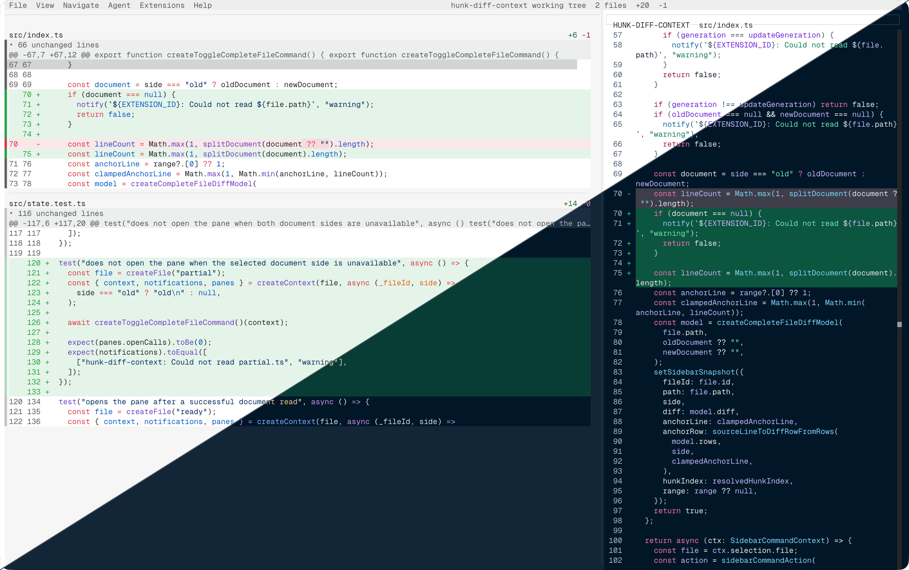

# Hunk Diff Context

A [Hunk](https://www.hunk.dev/) extension that shows the selected file in a
pinned sidebar.



## Install

Requires Hunk 0.19.0 or later.

```sh
hunk extension install astwys/hunk-diff-context
```

For a one-off local test:

```sh
hunk diff --extension .
```

## Usage

Press `Ctrl+O` to open, switch, or close the right-side pane:

- With the pane closed, it opens the selected file and hunk.
- With the pane open, pressing `Ctrl+O` on the same hunk closes it.
- Pressing `Ctrl+O` on another file or hunk replaces the pinned sidebar contents.

The sidebar stays pinned while you navigate. Selection changes alone do not
update it.

### Keyboard shortcut

The default shortcut is `Ctrl+O`. Remap it in Hunk's `[keybindings]`
configuration, in `~/.config/hunk/config.toml` or `.hunk/config.toml`:

```toml
[keybindings]
"hunk-diff-context.toggle-diff-context" = "ctrl+shift+o"
```

Set the value to `false` to disable the command.

The sidebar renders a complete, syntax-highlighted unified diff, including
unchanged, added, and removed lines.

### When to use this extension

Hunk's `z` shortcut changes the primary review view. This extension keeps the
normal Hunk view visible and adds a pinned complete-file diff beside it:

| Hunk `z` | Hunk Diff Context |
| --- | --- |
| Changes the primary review view | Adds a right-side pane |
| Uses the current review position | Pins the selected file and hunk |
| Replaces the current view temporarily | Keeps Hunk's files pane and hunk view intact |
| Shows the file in Hunk's normal view | Shows a complete unified diff with unchanged lines |

## Development

```sh
git clone https://github.com/astwys/hunk-diff-context.git
cd hunk-diff-context
pnpm install
pnpm test
pnpm typecheck
pnpm dev
```

`pnpm dev` runs `hunk diff --extension .` against the local checkout.

## License

[MIT](LICENSE)
